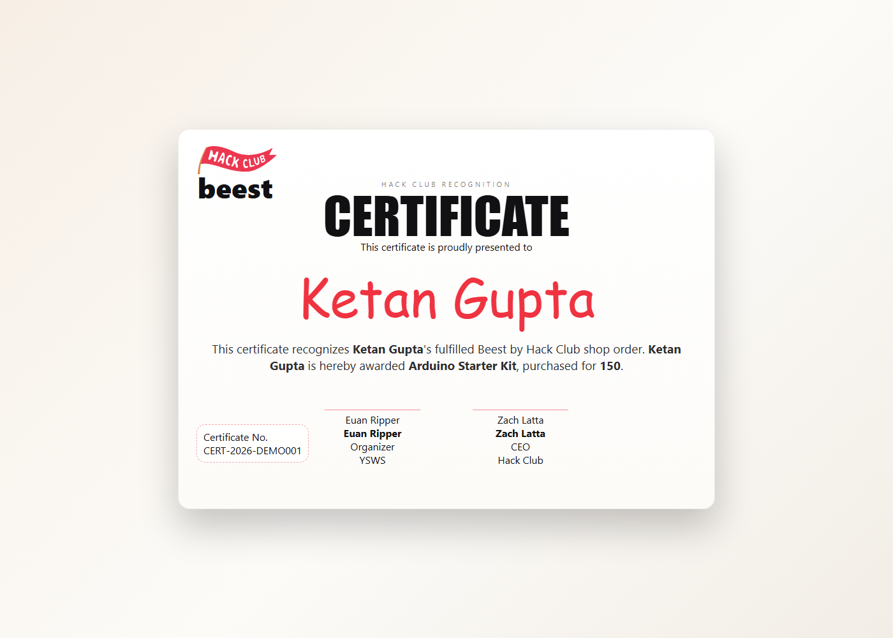
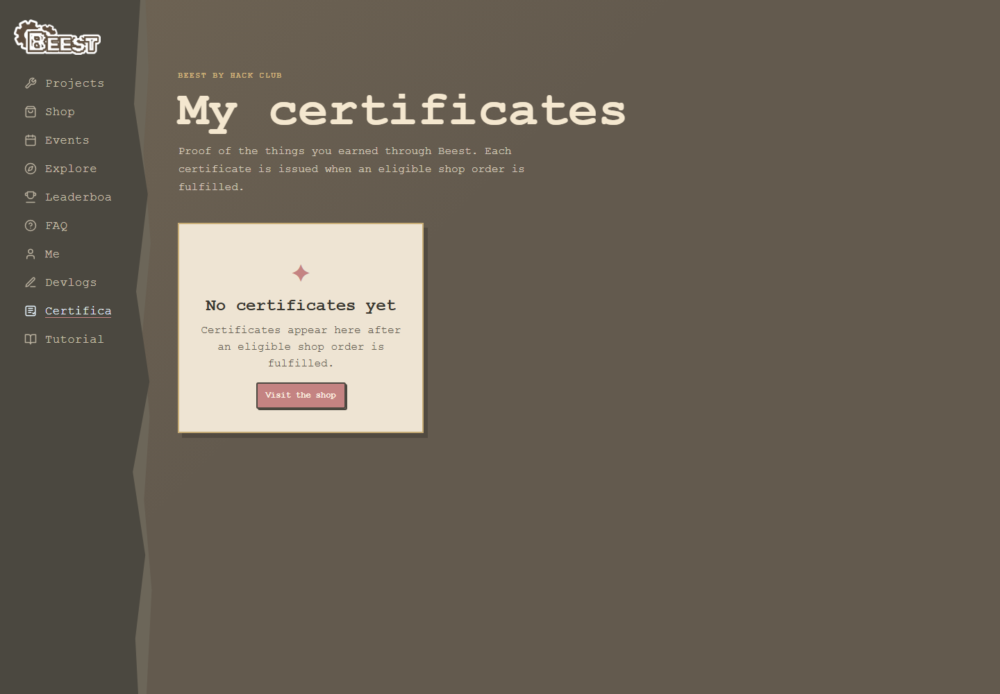

# Certificate preview

This screenshot is the visual test fixture for the issued certificate template.
The backend template is aligned with `frontend/static/example-certificate.html`.

## Certificates page

The certificates page lives at `/me/certificates`. This screenshot captures its
empty state when the signed-in user has not yet received an eligible fulfilled
shop order.

The preview uses sample certificate data:

- Recipient: Ketan Gupta
- Award: Arduino Starter Kit
- Cost: 150 Pipes
- Certificate number: CERT-2026-DEMO001
